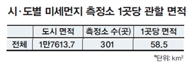
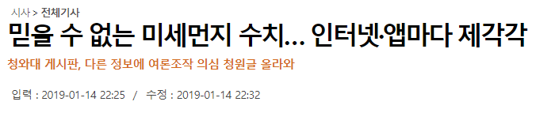
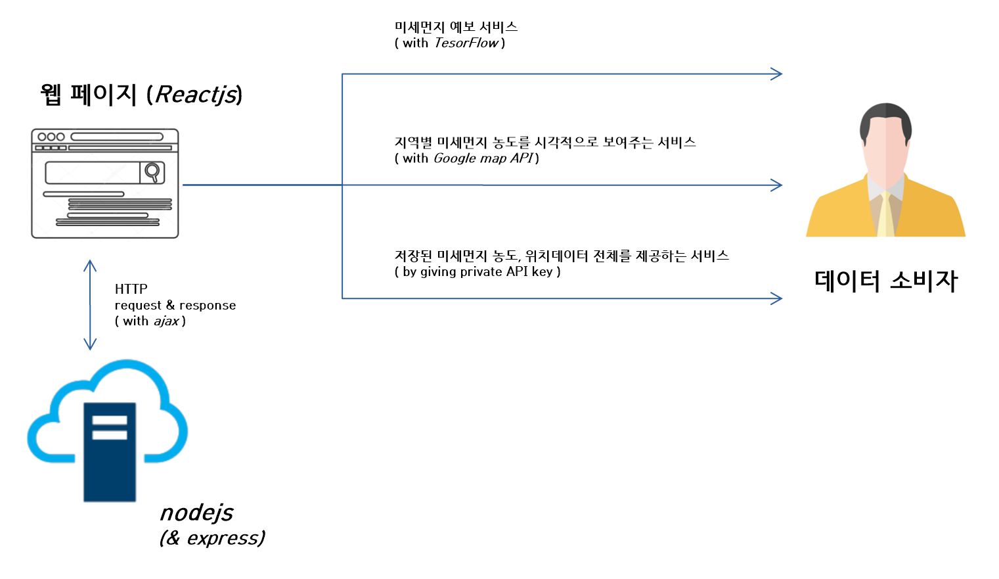

1.개요
===========
## 1.1. 미세먼지 토큰 IoT 플랫폼   
측정한 미세먼지 농도를 전송하면, 전송해준 사람에게 보상으로 암호화폐 토큰을 주고,  
전송받은 미세먼지 농도를 이용해 여러가지 서비스를 제공하는 플랫폼이다. (상세내용 후술)  
## 1.2. 왜 필요한가?   
### 1.2.1. 미세먼지 측정소 를 늘릴 수 있다.  

  

 
미세먼지 농도를 측정한 시민들에게 토큰을 보상으로 지급하기 때문에 자발적 미세먼지 센서 설치를 유도할 수 있다.  

### 1.2.2. 미세먼지 데이터 위조를 막을 수 있다.  

  

 
http://news.kmib.co.kr/article/view.asp?arcid=0012988785&code=61121111&sid1=int/feed   
전송받은 농도 데이터를 서버에 저장함과 동시에 블록체인에도 저장하기 때문에 데이터 조작을 막을 수 있다. (탈중앙화) 

* * *  
  
2.기술 시나리오
=============  
## 2.1. Platform

  

 
  
## 2.2. Service  

  

 
