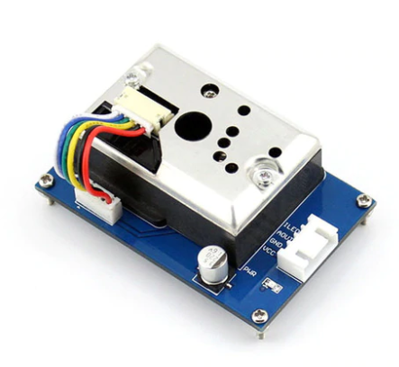
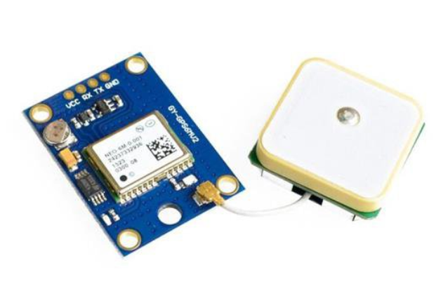

1.프로젝트 타이틀
===========  
<b> IoT & 블록체인 기반 미세먼지 </b>   

* * *  

# 2. 무엇을 만드는가 그리고 왜 만드는가?
## 2.1. 무엇을 만드는가?  
측정한 미세먼지 농도를 전송하면, 전송해준 사람에게 보상으로 암호화폐 토큰을 주고,  
전송받은 미세먼지 농도를 이용해서 소비자들에게 여러가지 서비스를 제공하는 플랫폼.   
## 2.2. 왜 만드는가?
미세먼지 데이터를 수집하기 위해 전국에 미세먼지 센서를 설치하고 관리하는 일은 비용이 많이 드는데 
시민들에게 현금화 가능한 토큰을 지급해서 자발적으로 미세먼지를 측정하게 하면, 적은 비용으로 전국의 미세먼지 빅데이터를 수집할 수 있다.

* * *  

 
#3.기술 시나리오
## 3.1. Platform

  

 
  
## 3.2. Services

  

  
  
  
## 3.3. 구현계획
| 순서 | 구현 내용 | 사용 기술 |
| --- | --- | --- |
| 1 | 센서 제작, 아두이노 펌웨어 작성. | Arduino. |
| 2 | 암호화폐 토큰 작성, 네트워크에 배포 | Remix, Solidity language. |
| 3 | 서버에 센서 데이터 수신, 데이터 베이스 저장 기능 추가 | nodejs, express, MySQL |
| 4 | 웹 페이지 디자인 및 구현 | Reactjs |
| 5 | 웹 페이지 회원정보 입력 기능 구현, 서버에 회원정보 전송 기능 구현 | ajax, javascript |
| 6 | 암호화폐 지갑으로 토큰 지급하는 기능 서버에 추가 | Web3, Metamask, nodejs |
| 7 | 서비스 payment 구현 | Web3, MetaMask, Ethereum |
| 8 | 웹 페이지에 서비스 어플리케이션 추가 | Reactjs, TensorFlow, Google map, ajax | 
* * *  

# 4. 데이터  
## 4.1. 서버와 블록체인에 저장할 데이터
  - 미세먼지 농도 (단위: μg )
  - 위도, 경도 (소수점 둘째 자리까지)  
  - 시간 (서버 전송시간 기준)  
  
## 4.2. 데이터 흐름도  

  

  
* * *  
  

# 5. 센서
|  sharp_gp2y1010au0f 미세먼지 측정 센서 | neo-6m gps 센서 |
| :---: | :---: |
| |  |  
| 미세먼지 농도 측정 | 위도, 경도 측정 |

* * *  
