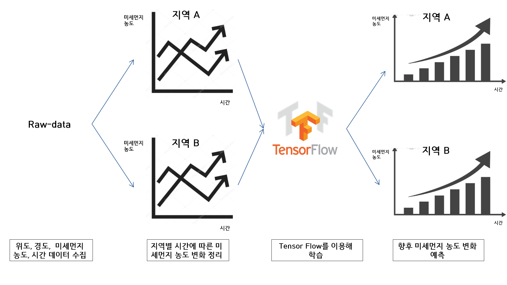

1.개요
===========
## 1.1. 미세먼지 토큰 IoT 플랫폼   
측정한 미세먼지 농도를 전송하면, 전송해준 사람에게 보상으로 암호화폐 토큰을 주고,  
전송받은 미세먼지 농도를 이용해서 소비자들에게 여러가지 서비스를 제공하는 플랫폼이다.   
## 1.2. 프로젝트 파급효과   
### 1.2.1. 저비용으로 빅데이터를 수집할 수 있다.  
미세먼지 데이터를 수집하기 위해 전국에 미세먼지 센서를 설치하고 관리하는 일은 비용이 많이 든다. 
하지만, 시민들에게 현금화 가능한 토큰을 지급해서 자발적으로 미세먼지를 측정하게 하면, 적은 비용으로 전국의 미세먼지 데이터를 수집할 수 있다.

### 1.2.2. 시민들에게 신뢰도 높은 데이터를 제공할 수 있다.

  

 
http://news.kmib.co.kr/article/view.asp?arcid=0012988785&code=61121111&sid1=int/feed   
전송받은 농도 데이터를 서버에 저장함과 동시에 블록체인에도 저장하기 때문에 제3자의 데이터 조작은 불가능하다.
* * *  
  
2.기술 시나리오
=============  
## 2.1. Platform

  

 
  
## 2.2. Services

  

  

* * *  

# 3. 센서
|  sharp_gp2y1010au0f 미세먼지 측정 센서 | neo-6m gps 센서 |
| :---: | :---: |
| |  |  
| 미세먼지 농도 측정 | 위도, 경도 측정 |

* * *  
# 4. 데이터  
## 4.1. 서버와 블록체인에 저장할 데이터
  - 미세먼지 농도 (단위: μg )
  - 위도, 경도 (소수점 둘째 자리까지)  
  - 시간 (DB 저장 시간 기준)  
  
## 4.2. 데이터 활용 플랜

  

  
